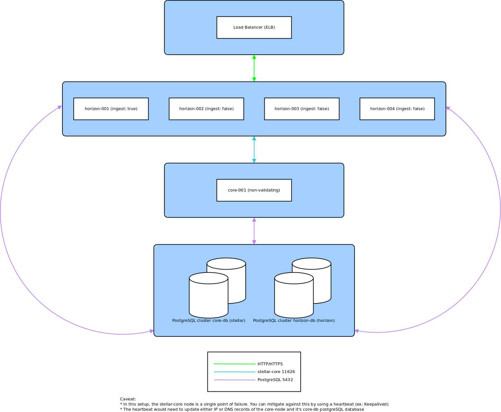

# SDF - packages

## Package based installation

If you are using Ubuntu 16.04 LTS we provide the latest stable releases of [stellar-core](https://github.com/stellar/stellar-core) and [stellar-horizon](https://github.com/stellar/go/tree/master/services/horizon) in Debian binary package format.

You may choose to install these packages individually, this offers the greatest flexibility but will require **manual** creation of the relevant configuration files and the configuration of a **PostgreSQL** database.

Alternatively you may choose to install the **stellar-quickstart** package which configures a **Testnet** `stellar-core` and `stellar-horizon` both backed by a local PostgreSQL database.

#
1. [Adding the SDF stable repository to your system](#adding-the-sdf-stable-repository-to-your-system)
2. [Quickstart](#quickstart)
3. [Installing individual packages](#installing-individual-packages)
4. [Upgrading](#upgrading)
5. [Running Horizon in production](#running-horizon-in-production)

## Adding the SDF stable repository to your system

In order to use our repository you will need to **add our GPG public key** to your system and create a sources file.

The key we use (A136B5A6), is available from https://pgp.mit.edu with fingerprint:

**AEAF 01EE A6CA FCEF DDAE  8AA7 0463 8272 A136 B5A6**

### Download and install the public signing key:

```
wget -qO - https://apt.stellar.org/SDF.asc | sudo apt-key add -
```

### Save the repository definition to /etc/apt/sources.list.d/SDF.list:

```
echo "deb https://apt.stellar.org/public stable/" | sudo tee -a /etc/apt/sources.list.d/SDF.list
```

## Quickstart

The **stellar-quickstart** package configures a local `stellar-core` and `stellar-horizon` instance backed by a local PostgreSQL connecting to the **SDF Testnet**. Once installed you can easily modify either the `stellar-core` or `stellar-horizon` configs to suit your needs or to connect to the **SDF Pubnet** for example.

### Installation

```
# sudo apt-get update && sudo apt-get install stellar-quickstart # install packages
# sudo systemctl start stellar-core # start up stellar-core
# stellar-core-cmd info # check/wait until stellar-core is in synch
# sudo systemctl start stellar-horizon # start up stellar-horizon
```

#### Accessing the quickstart databases

The stellar-quickstart package configures 2 databases, `stellar` and `horizon`. Access to these databases is managed via the `stellar` PostgreSQL role and it's corresponding `stellar` system user.

```
# sudo -u stellar psql -d stellar
psql (9.5.10)
Type "help" for help.

stellar=> \dt
            List of relations
 Schema |     Name      | Type  |  Owner
--------+---------------+-------+---------
 public | accountdata   | table | stellar
 public | accounts      | table | stellar
 public | ban           | table | stellar
 public | ledgerheaders | table | stellar
 public | offers        | table | stellar
 public | peers         | table | stellar
 public | publishqueue  | table | stellar
 public | pubsub        | table | stellar
 public | scphistory    | table | stellar
 public | scpquorums    | table | stellar
 public | signers       | table | stellar
 public | storestate    | table | stellar
 public | trustlines    | table | stellar
 public | txfeehistory  | table | stellar
 public | txhistory     | table | stellar
(15 rows)
```

#### stellar-core --newdb

As with [accessing the database directly](#accessing-the-quickstart-databases), you can re-initialise the `stellar-core` db by running `stellar-core` as the `stellar` system user.

```
# sudo -u stellar stellar-core --conf /etc/stellar/stellar-core.cfg --newdb
2018-01-22T19:43:20.715 GABA2 [Database INFO] Connecting to: postgresql://dbname=stellar user=stellar
2018-01-22T19:43:20.719 GABA2 [SCP INFO] LocalNode::LocalNode@GABA2 qSet: 273af2
2018-01-22T19:43:20.833 GABA2 [Database INFO] Applying DB schema upgrade to version 2
2018-01-22T19:43:20.851 GABA2 [Database INFO] Applying DB schema upgrade to version 3
2018-01-22T19:43:20.857 GABA2 [Database INFO] Applying DB schema upgrade to version 4
2018-01-22T19:43:20.866 GABA2 [Database INFO] Applying DB schema upgrade to version 5
2018-01-22T19:43:20.872 GABA2 [default INFO] *
2018-01-22T19:43:20.872 GABA2 [default INFO] * The database has been initialized
2018-01-22T19:43:20.872 GABA2 [default INFO] *
2018-01-22T19:43:20.874 GABA2 [Ledger INFO] Established genesis ledger, closing
2018-01-22T19:43:20.874 GABA2 [Ledger INFO] Root account seed: SCXXZABQBBVSHQLXASSQU7MQSCOI56JMB24GTJGKKPUY3SYLGBASEGQ6
2018-01-22T19:43:20.879 GABA2 [default INFO] *
2018-01-22T19:43:20.879 GABA2 [default INFO] * The next launch will catchup from the network afresh.
2018-01-22T19:43:20.879 GABA2 [default INFO] *
2018-01-22T19:43:20.879 GABA2 [default INFO] Application destructing
2018-01-22T19:43:20.879 GABA2 [default INFO] Application destroyed
```

##### moving on from Quickstart

`stellar-quickstart` is a **configuration** package that through it's dependencies pulls in the required packages.

| Package                  | Dependencies                | Comments                                                                           |
|:-------------------------|:----------------------------|:-----------------------------------------------------------------------------------|
| stellar-core             | stellar-core-utils          | installs stellar-core binary, systemd service, logrotate script, documentation     |
| stellar-core-utils       | none                        | installs useful command line tools (stellar-core-cmd)                              |
| stellar-core-postgres    | stellar-core, PostgreSQL    | configures a PostgreSQL server, creates a stellar db,role and system user          |
| stellar-horizon          | none                        | installs stellar-horizon binary, systemd service                                   |
| stellar-horizon-postgres | stellar-horizon, PostgreSQL | configures a PostgreSQL server, creates a horizon db and stellar role, system user |
| stellar-quickstart       | stellar-core-postgres, stellar-horizon-postgres | pulls in required packages via it's dependencies               |

Once you are comfortable with the various packages that `stellar-quickstart` brings in as dependencies, it is possible to install them individually.

See [Running Horizon in production](#running-horizon-in-production) for a generic distributed Horizon cluster, you will need to configure **PostgreSQL** which unfortunately is out of the scope of this document.

## Installing individual packages

If you choose to install the individual packages, you will need to install your own configuration files as well as configure PostgreSQL.

* **stellar-core:** is configured by modifying `/etc/stellar/stellar-core.cfg`
* **stellar-horizon:** is configured by modifying `/etc/default/stellar-horizon`

### Installation

* `apt-get update && apt-get install stellar-core` or `apt-get update && apt-get install stellar-horizon`
* deploy suitable configs, see [docs](https://www.stellar.org/developers/software/)
* `systemctl start stellar-core` or `systemctl start stellar-horizon`

##### Systemd Unit

For convenience our packages install a Systemd service `/lib/systemd/system/stellar-core.service` or `/lib/systemd/system/stellar-horizon.service`. These services are loaded by default but as a precaution you will still need to start the services manually post installation.

Should you want these services to start up after a reboot, you will need to run:

`systemctl enable stellar-core` or `systemctl enable stellar-horizon`

##### Logrotate

The stellar-core Debian package installs a Logrotate script under `/etc/logrotate.d/stellar-core`.

Due to the way stellar-core currently manages it's logs, we are temporarily using `copytruncate` to rotate the logs. Unfortunately, a minimal amount of log entries may be lost with this setup. We are actively looking at ways of improving this.

You can disable automatic logrotation `rm -r /etc/logrotate.d/stellar-core`

```
/var/log/stellar/*.log {
  daily
  missingok
  rotate 14
  compress
  notifempty
  copytruncate
  create 0640 stellar stellar
}
```

##### stellar-core-cmd

This simple script wraps a curl call to the stellar-core http endpoint.

```json
stellar-core-cmd info
{
   "info" : {
      "UNSAFE_QUORUM" : "UNSAFE QUORUM ALLOWED",
      "build" : "stellar-core 0.6.4 (631687e6324a5f1bcbd92982fee3fd51fa1b80a2)",
      "ledger" : {
         "age" : 1,
         "closeTime" : 1512646297,
         "hash" : "6b01ce7ca7528632c0e2afd9387f7fddcdae7e17bc4101373c92e35b91ea0c29",
         "num" : 5822467
      },
      "network" : "Test SDF Network ; September 2015",
      "numPeers" : 3,
      "protocol_version" : 8,
      "quorum" : {
         "5822466" : {
            "agree" : 3,
            "disagree" : 0,
            "fail_at" : 2,
            "hash" : "273af2",
            "missing" : 0,
            "phase" : "EXTERNALIZE"
         }
      },
      "state" : "Synced!"
   }
}
```

## Upgrading

##### stellar-core

```
# stellar-core --version
# stellar-core 9.0.0 (a79bfa71d221df9f68be36e3aa3dd7ffd71094ef)
# sudo apt-get update && sudo apt-get install stellar-core
# ...
# sudo systemctl start stellar-core
# stellar-core --version
# stellar-core 9.0.1 (7ad53a57f9f279d9f1697a3699ba23ed74177043)
```

## Running Horizon in production

Running your own distributed Horizon setup is **highly** recommended for production environments.

**reminder:** the SDF horizon cluster does not have an SLA!

How you achieve this **distributed environment** is dependent on your internal infrastructure. If possible, using managed services such as AWS (ELB,RDS,EC2) or other cloud providers will greatly simplify your environment.

Given this, the following principles should apply to most hosting environments.

 * distribute the Horizon service across multiple **load-balanced** instances (ELB,EC2)
 * only `ingest` on 1 horizon node
 * run a dedicated **non-validating** `stellar-core` instance which the Horizon cluster will connect to and ingest from
 * run a highly available [PostgreSQL cluster](https://www.postgresql.org/docs/9.5/static/high-availability.html) ( or RDS) for each of the required databases (`stellar`,`horizon`)
 * use a heartbeat ([Keepalived](https://github.com/acassen/keepalived)) to avoid `core-001` becoming a Single Point Of Failure
   * during failover 2 services need to be updated, the `core-db` and `stellar-core` instance accessed by the Horizon nodes


