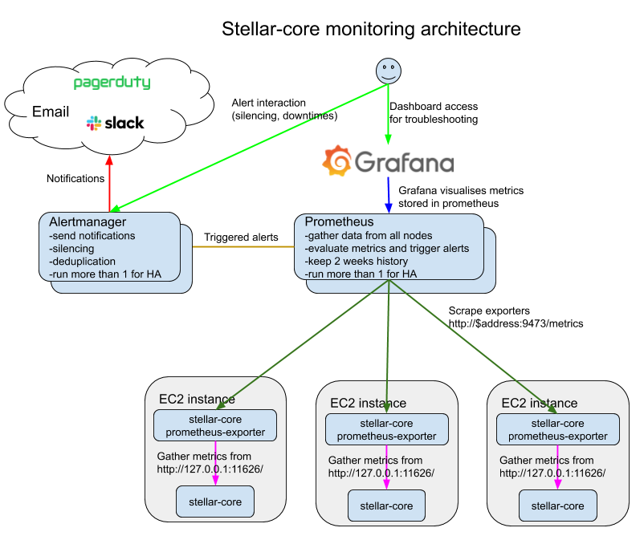

# SDF - packages
  
1.  [Adding the SDF stable repository to your system](adding-the-sdf-stable-repository-to-your-system.md)
2.  [Quickstart](quickstart.md)
3.  [Installing individual packages](installing-individual-packages.md)
4.  [Upgrading](upgrading.md)
5.  [Running Horizon in production](running-horizon-in-production.md)
6.  [Building Packages](building-packages.md)
7.  [Running a Full Validator](running-a-full-validator.md)
8.  [Publishing a History archive](publishing-a-history-archive.md)
9.  [Backfilling a History archive](backfilling-a-history-archive.md)
10. [Monitoring](monitoring.md)
11. [Testnet Reset](testnet-reset.md)

### Monitoring
Monitoring `stellar-core` using Prometheus is by far the simplest solution, especially if you already have a Prometheus server within your infrastructure. Prometheus is a free and open source time-series database with a simple yet incredibly powerful query language `PromQL`, Prometheus is also tightly integrated with Grafana and enables us to render complex visualisations with ease.

In order for Prometheus to scrape `stellar-core` application metrics, you will need to install the stellar-core-prometheus-exporter (`apt-get install stellar-core-prometheus-exporter`) and configure your Prometheus server to scrape this exporter (default port: `9473`). On top of that grafana can be used to visualize metrics.



#### Install a Prometheus server within your infrastructure
Installing and configuring a Prometheus server is out of scope of this document, however it is a fairly simple process, Prometheus is a single Go binary which you can download from https://prometheus.io/docs/prometheus/latest/installation/.

#### Install the stellar-core-prometheus-exporter
The stellar-core-prometheus-exporter is an exporter that scrapes the `stellar-core` metrics endpoint (`http://localhost:11626/metrics`) and renders these metrics in the Prometheus text based format available for Prometheus to scrape and store in it's timeseries database.

The exporter needs to be installed on every stellar-core node you wish to monitor.

* `apt-get install stellar-core-prometheus-exporter`

You will need to open up port `9473` between your Prometheus server and all your `stellar-core` nodes for your Prometheus server to be able to scrape `stellar-core` metrics.

#### Point Prometheus to stellar-core-prometheus-exporter
Pointing your Prometheus instance to the exporter can be achieved by manually configuring a scrape job, depending on the number of hosts you need to monitor this quickly becomes unwieldy. With this in mind the process can also be automated using Prometheus' various "service discovery" plugins. For example with AWS hosted instance you can use the `ec2_sd_config` plugin.

##### Manual
```yaml
- job_name: 'stellar-core'
  scrape_interval: 10s
  scrape_timeout: 10s
  static_configs:
    - targets: ['core-node-001.example.com:9473', 'core-node-002.example.com:9473'] # stellar-core-prometheus-exporter default port is 9473
    - labels:
      application: 'stellar-core'
```

##### Using Service Discovery (EC2)
```yaml
- job_name: stellar-core
  scrape_interval: 10s
  scrape_timeout: 10s
  ec2_sd_configs:
  - region: eu-west-1
    port: 9473
  relabel_configs:
  # ignore stopped instances
  - source_labels: [__meta_ec2_instance_state]
    regex: stopped
    action: drop
  # only keep with `core` in the Name tag
  - source_labels: [__meta_ec2_tag_Name]
    regex: "(.*core.*)"
    action: keep
  # use Name tag as instance label
  - source_labels: [__meta_ec2_tag_Name]
    regex: "(.*)"
    action: replace
    replacement: "${1}"
    target_label: instance
  # set application label to stellar-core
  - source_labels: [__meta_ec2_tag_Name]
    regex: "(.*core.*)"
    action: replace
    replacement: stellar-core
    target_label: application
```

#### Create Alerting Rules

Once prometheus scrapes metrics we can add alerting rules. Recommended rules are [**here**](stellar-core-alerting.rules) (require prometheus 2.0 or later). Copy rules to */etc/prometheus/stellar-core-alerting.rules* on the prometheus server and add the following to the prometheus configuration file to include the file:
```yaml
rule_files:
- "/etc/prometheus/stellar-core-alerting.rules"
```

Rules are documented in-line and we strongly recommend that you review and verify all of them as every environment is different.

#### Configure Notifications Using Alertmanager

Alertmanager is responsible for sending notifications. Installing and configuring an Alertmanager server is out of scope of this document, however it is a fairly simple process, official documentation is [here](https://github.com/prometheus/alertmanager/).

All recommended alerting rules have "severity" label:
* **critical** - normally require immediate attention. They indicate an ongoing or very likely outage. We recommend that critical alerts notify administrators 24x7
* **warning** - normally can wait until working hours. Warnings indicate problems that likely do not have production impact but may lead to critical alerts or outages if left unhandled

The following example alertmanager configuration demonstrates how to send notifications using different methods based on severity label:

```yaml
global:
  smtp_smarthost: localhost:25
  smtp_from: alertmanager@example.com
route:
  receiver: default-receiver
  group_by: [alertname]
  group_wait: 30s
  group_interval: 5m
  repeat_interval: 1h
  routes:
  - receiver: critical-alerts
    match:
      severity: critical
  - receiver: warning-alerts
    match:
      severity: warning
receivers:
- name: critical-alerts
  pagerduty_configs:
  - routing_key: <PD routing key>
- name: warning-alerts
  slack_configs:
  - api_url: https://hooks.slack.com/services/slack/warning/channel/webhook
- name: default-receiver
  email_configs:
  - to: alerts-fallback@example.com
```

In the above examples alerts with severity "critical" are sent to pagerduty and warnings are sent to slack

#### Useful Exporters

You may find the below exporters useful for monitoring your infrastructure as they provide incredible insight into your operating system and database metrics. Unfortunately installing and configuring these exporters is out of the scope of this document but should be relatively straightforward.

* [node_exporter](https://prometheus.io/docs/guides/node-exporter/) can be used to track all operating system metrics.
* [postgresql_exporter](https://github.com/wrouesnel/postgres_exporter) can be used to monitor the local stellar-core database.

#### Visualize metrics using Grafana
Now that you have configured Prometheus to scrape and store your stellar-core metrics, you will want a nice way to render this data for human consumption. Grafana offers the simplest and most effective way to achieve this. Again installing Grafana is out of scope of this document but is a very simple process, especially when using the prebuilt apt packages (https://grafana.com/docs/installation/debian/#apt-repository)

We recommend that administrators import the following two dashboards into their grafana deployments:
* [**Stellar Core Monitoring**](https://grafana.com/grafana/dashboards/10603) - shows the most important metrics, node status and tries to surface common problems. It's a good troubleshooting starting point
* [**Stellar Core Full**](https://grafana.com/grafana/dashboards/10334) - shows a simple health summary as well as all metrics exposed by the `stellar-core-prometheus-exporter`. It's much more detailed than the *Stellar Core Monitoring* and might be useful during in-depth troubleshooting
