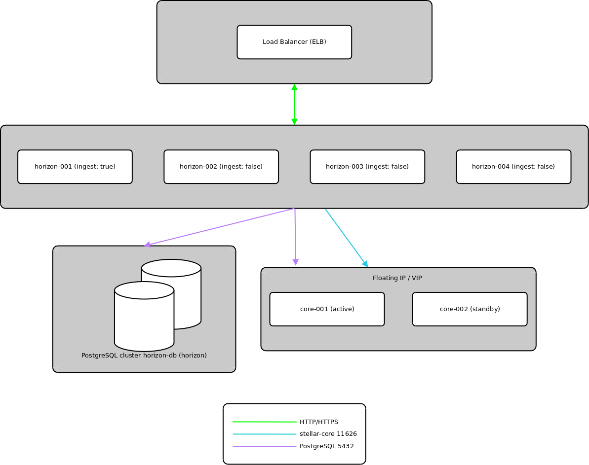

# SDF - packages
  
1.  [Adding the SDF stable repository to your system](adding-the-sdf-stable-repository-to-your-system.md)
2.  [Quickstart](quickstart.md)
3.  [Installing individual packages](installing-individual-packages.md)
4.  [Upgrading](upgrading.md)
5.  [Running Horizon in production](running-horizon-in-production.md)
6.  [Building Packages](building-packages.md)
7.  [Running a Full Validator](running-a-full-validator.md)
8.  [Publishing a History archive](publishing-a-history-archive.md)
9.  [Backfilling a History archive](backfilling-a-history-archive.md)
10. [Monitoring](monitoring.md)
11. [Testnet Reset](testnet-reset.md)

## Running Horizon in production

Running your own distributed Horizon setup is **highly** recommended for production environments.

**reminder:** the SDF horizon cluster does not have an SLA!

How you achieve this **distributed environment** is dependent on your internal infrastructure. If possible, using managed services such as AWS (ELB,RDS,EC2) or other cloud providers will greatly simplify your environment.

Given this, the following principles should apply to most hosting environments.

 * distribute the Horizon service across multiple **load-balanced** instances (ELB,EC2)
 * only `ingest` on 1 horizon node
 * run a highly available [PostgreSQL cluster](https://www.postgresql.org/docs/9.5/static/high-availability.html) ( or RDS) for the `horizon` database
 * run a **non-validating** `stellar-core` instance which the Horizon cluster will use to ingest and submit transactions to, Horizon needs access to stellar-core on port 11626 as well as to the PostgreSQL database on port 5432.
 * run a standby **non-validating** `stellar-core` instance which the Horizon cluster can failover to for ingestion and transaction submission
 * use a floating IP or virtual IP to manage failovers to the standby core when required
   * during failover the `core-db` and `stellar-core` instance accessed by Horizon need to be updated, we suggest using a DNS record to avoid having to update configuration files

